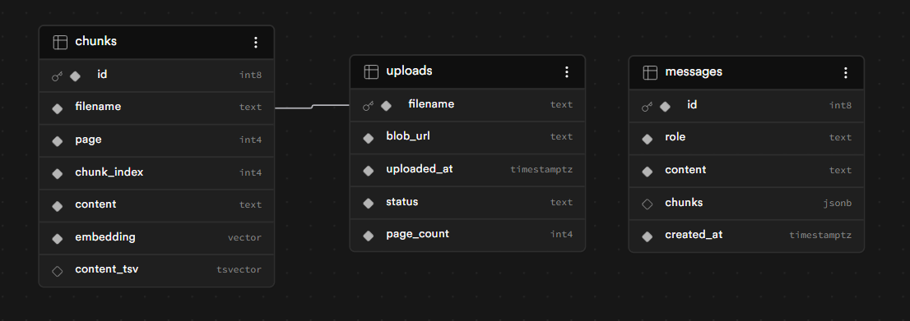

# Not ChatGPT

Upload PDFs and ask questions with persistent chat memory. The app extracts, chunks, and embeds your documents — then uses hybrid search (semantic + keyword, fused with Reciprocal Rank Fusion) and an LLM to answer questions with inline citations. Conversation history is stored in PostgreSQL and restored on page load.

## How it works

**Upload flow**
1. Browser requests a signed upload token from `/request_upload_token` (HMAC-SHA256, 1-hour TTL)
2. `@vercel/blob` SDK uploads the PDF directly from the browser to Vercel Blob CDN
3. Browser calls `/upload-complete`; backend records the file and starts a background task
4. Background task: download PDF → extract text per page (pypdf) → chunk (800 chars, 100 overlap) → embed (HuggingFace, 384-dim) → store in PostgreSQL with pgvector + tsvector

**Chat flow (persistent)**
1. Browser POSTs `{question, search_mode?}` to `/chat`
2. Backend loads full conversation history from the `messages` table
3. Embeds question → searches chunks → LLM generates answer with history context (last 6 turns)
4. Both turns saved to `messages`; response includes answer, chunks, and latency
5. On page load, `GET /history` restores the full thread

**Search modes**
- **hybrid** (default): pgvector cosine search + PostgreSQL `ts_rank`, fused with Reciprocal Rank Fusion (RRF, k=60)
- **semantic**: pgvector cosine search only
- **keyword**: full-text search only, OR-joined `to_tsquery`

## Stack

| Layer | Technology |
|---|---|
| Frontend | React 18, `@vercel/blob` |
| Backend | FastAPI, Python 3.10 |
| Database | PostgreSQL + pgvector + tsvector (GIN index) |
| Search | Hybrid RRF — pgvector cosine + `ts_rank` full-text |
| Embeddings | HuggingFace Inference API — `sentence-transformers/all-MiniLM-L6-v2` (384-dim) |
| LLM | HuggingFace Inference API — `meta-llama/Llama-3.2-1B-Instruct` |
| Storage | Vercel Blob |
| Infra | Docker Compose (local), Vercel (prod) |

## Quick start

```bash
cp .env.example .env        # fill in the variables (see below)
docker compose up --build   # FastAPI on :8000, React on :3000
```

Swagger UI: http://localhost:8000/docs

## Environment variables

| Variable | Required | Default | Description |
|---|---|---|---|
| `DATABASE_URL` | Yes | — | PostgreSQL connection string |
| `BLOB_READ_WRITE_TOKEN` | Yes | — | Vercel Blob token for minting signed client upload tokens |
| `HF_TOKEN` | No | — | HuggingFace API key (embeddings + LLM) |
| `HF_EMBED_MODEL` | No | `sentence-transformers/all-MiniLM-L6-v2` | Embedding model |
| `HF_LLM_MODEL` | No | `meta-llama/Llama-3.2-1B-Instruct` | LLM for answer generation |

Without `HF_TOKEN`, embedding and answer generation will fail. Without `BLOB_READ_WRITE_TOKEN`, uploads will fail. The app still starts and serves `/health`.

## API

| Method | Path | Description |
|---|---|---|
| GET | `/health` | Liveness + DB connectivity status |
| POST | `/request_upload_token` | Mint a signed client token for browser → Vercel Blob upload |
| POST | `/upload-complete` | Record upload and schedule background indexing |
| GET | `/documents` | List all documents with status, page count, and chunk count |
| DELETE | `/files/{filename}` | Delete a document and all its chunks |
| POST | `/chat` | Persistent chat — search + LLM with conversation history |
| GET | `/history` | Return full conversation history |
| POST | `/query` | Stateless search + LLM (no history saved, kept for compatibility) |

### Chat request/response

```json
// POST /chat
{
  "question": "What is the refund policy?",
  "top_k": 5,
  "search_mode": "hybrid"
}

// Response
{
  "answer": "Refunds are issued within 30 days [policy.pdf p.4].",
  "chunks": [{ "filename": "policy.pdf", "page": 4, "score": 0.0161, "content": "..." }],
  "latency": { "embed": 45, "search": 12, "llm": 234, "total": 291 }
}
```

`top_k` is clamped to [1, 20]. `filenames` is optional; omit to search across all documents.

## Document statuses

| Status | Meaning |
|---|---|
| `pending` | Upload received; indexing in progress |
| `indexed` | Text extracted, chunked, and embedded successfully |
| `skipped` | PDF contained no extractable text (scanned/image-only) |
| `failed` | Indexing error (check logs) |

## Tests

```bash
docker compose exec fastapi python -m pytest tests/test_api.py tests/test_database.py -v
```

- **`test_api.py`** (15 tests) — FastAPI TestClient with mocked dependencies; no live services needed. Covers health, documents, history, `/query`, `/chat`, error paths.
- **`test_database.py`** (10 tests) — Integration tests against a live database. Covers messages CRUD, upload CRUD, status updates, and error cases.

### Baseline Evaluation

Two scripts live in `backend/tests/retriever-evaluation/`:

**1. Generate a gold set** — samples random chunks from the indexed PDFs and uses Claude to write a factual QA pair per chunk. Appends to the output file on repeated runs.

```bash
# from backend/
python tests/retriever-evaluation/generate_gold_set.py --sample-n 20
# options: --model, --out, --max-tokens, --delay
```

**2. Evaluate retrieval** — runs every question against the live `/query` API across all three search modes and reports Precision@k, Recall@k, and F1.

```bash
# from backend/
python tests/retriever-evaluation/evaluate.py \
  --qa tests/retriever-evaluation/gold_set.json \
  --top-k 5 \
  --out tests/retriever-evaluation/results.json
```

Results on a 20-question gold set sampled from indexed ML/AI textbooks (top-k=5):

| Mode | Precision@5 | Recall@5 | F1 |
|---|---|---|---|
| hybrid | 10.0% | 40.0% (8/20) | 16.0% |
| semantic | 6.0% | 30.0% (6/20) | 10.0% |
| keyword | 19.0% | 80.0% (16/20) | 30.7% |

Keyword search leads on this corpus because the gold set questions are generated directly from chunk text, making exact-term overlap high. Hybrid and semantic search are expected to gain ground on paraphrased or conversational queries.

**3. Evaluate answer quality** — uses Claude as a judge to score each generated answer on faithfulness (is every claim grounded in the retrieved context?) and answer relevance (does the answer address the question?). Requires a gold set and a running API.

```bash
# from project root
PYTHONPATH=backend backend/.venv/bin/python backend/tests/retriever-evaluation/answer_quality.py \
  --qa backend/tests/retriever-evaluation/gold_set.json \
  --mode hybrid \
  --out backend/tests/retriever-evaluation/aq_results.json
# use --mode all to evaluate all three search modes
```

Results on a 10-question gold set from indexed ML/AI papers (`meta-llama/Llama-3.2-1B-Instruct`, top-k=5):

| Mode | Faithfulness | Answer Relevance | Scored | Skipped |
|---|---|---|---|---|
| hybrid | 0.56 | 0.48 | 7/10 | 3 |

- **Faithfulness 0.56** — the 1B Llama model frequently hallucinated claims not present in the retrieved context.
- **Answer Relevance 0.48** — answers were often technically grounded but did not directly address the question.
- **3 skipped** — retrieval returned no chunks for those questions (retrieval failure, not generation failure).

These scores establish the baseline before planned improvements (re-ranking, better chunking, stronger LLM).

## Project structure

```
backend/
  src/
    main.py              routes, lifespan startup, dependency injection
    config.py            pydantic settings (auto-sets route prefix on Vercel)
    schemas.py           Pydantic request/response models
    interfaces.py        Protocol definitions — Database, Embedder, Extractor, Generator

    ingestion/
      service.py         IngestionService — download → parse → embed → store
      pdf_parser.py      pypdf extraction, 800-char chunks / 100-char overlap
      upload_token.py    HMAC-SHA256 client token minting (1-hour TTL)

    inference/
      embedding.py       HuggingFace embedding service (384-dim, batched)
      generator.py       HuggingFace LLM — history-aware answer generation

    storage/
      database.py        PostgreSQL connection and schema setup
      chunks.py          Chunk storage — pgvector + tsvector indexing and search
      uploads.py         Upload record CRUD
      messages.py        Conversation history CRUD

    utils/
      latency.py         LatencyTracker helper

  tests/
    test_api.py          API tests (mocked)
    test_database.py     DB integration tests
    test_end_to_end.py   End-to-end tests

    retriever-evaluation/
      generate_gold_set.py  Sample chunks → Claude → QA pairs (appends to gold_set.json)
      evaluate.py           Benchmark Precision/Recall/F1 across hybrid/semantic/keyword modes
      answer_quality.py     Claude-as-judge answer quality eval — faithfulness + answer relevance
      gold_set.json         Accumulated gold QA pairs (generated, gitignored)
      results.json          Latest retrieval evaluation results (generated, gitignored)
      aq_results.json       Latest answer quality results (generated, gitignored)

frontend/src/
  App.js                 two-column layout — sidebar + chat panel
  api/api.js             HTTP client for all backend routes
  components/
    UploadSection.js     "+ Upload Document" button, progress bar
    DocumentsSection.js  knowledge base file list with hover-delete
    ChatSection.js       persistent chat thread, search mode toggle, send button
    DevPanel.js          always-on right panel — session stats, latency bars, chunk inspector
```

## Deployment (Vercel)

`vercel.json` routes the frontend to `/` and the API to `/_/backend/*` using vercel.json


## Limitations

- No OCR support — scanned or image-only PDFs are marked `skipped`
- No user authentication — conversation history is global (single shared thread)
- Maximum 100 MB per PDF
- Chunking is character-based; very short pages may produce fewer or no chunks
- LLM context is capped at the last 6 conversation turns to stay within token limits
- Ingestion pipeline is still not asnyc

## DB Schema

